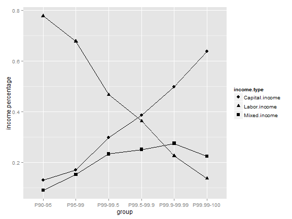
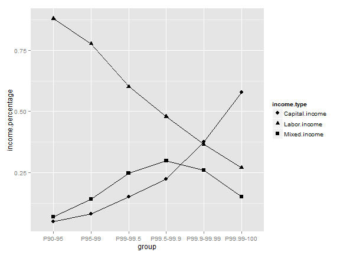
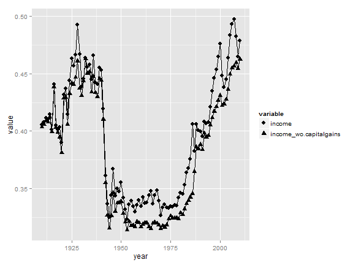
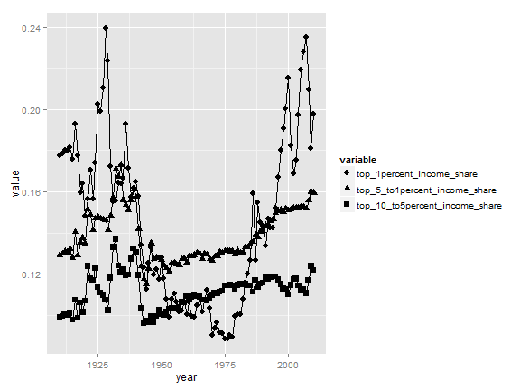
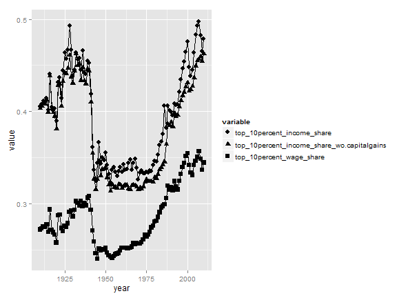
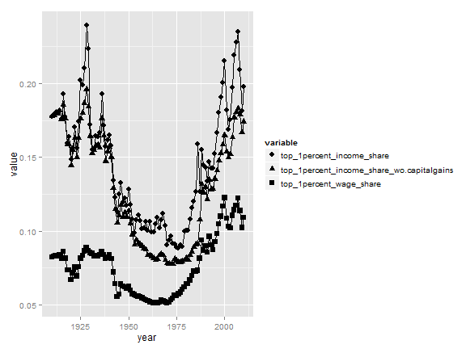
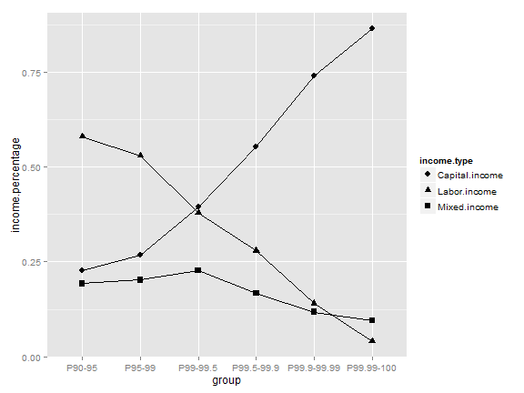
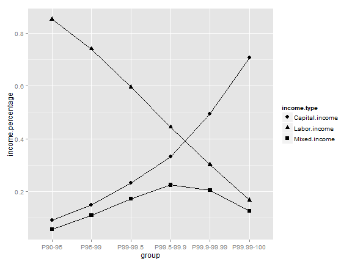

Capital in the 21st Century: Chapter 8
========================================================

### Data provenance

The data were downloaded as Excel files from: http://piketty.pse.ens.fr/en/capital21c2. 

### Loading relevant libraries and data

This document depends on the [xlsx](http://cran.r-project.org/web/packages/xlsx/index.html), [reshape2](http://cran.r-project.org/web/packages/reshape2/index.html), and [ggplot2](http://cran.r-project.org/web/packages/ggplot2/index.html) packages.


```r
library(ggplot2)
library(xlsx)
library(reshape2)
```

## Table Loads

Three tables from Chapter8TablesFigures.xlsx are used as source data for this chapter. An additional four tables are included which appear to be used in Chapter 9. All seven of these tables are derived from a single WTID table, with various levels of processing applied. The tables are loaded straight from the spreadsheet, with an ultimate goal to duplicate the calculations applied to the WTID data later. Some of the calculations to derive, for example, TS8.1 call for closer inspection. For example the 1911 data for top 10% income share value is recorded as an average of the 1910 and 1913 data. The 1913 data, in turn, is simply the 1910 data plus 1/2%. 

* TS8.1 Top Income and top wage shares in France 1900-2010  
* TS8.2 Top Income and top wage shares in USA 1900-2010
* TS8.3 Top income composition in France and the USA
* DetailTS9.2, DetailsTS9.3, DetailsTS9.4 and DetailsTS9.5

Source data DetailsWTIDseries

### Table TS8.1


```r
## Table TS8.1
fname="../Piketty2014FiguresTables/Chapter8TablesFigures.xlsx"
tabname="TS8.1"
ts81 = read.xlsx(fname,sheetName=tabname,rowIndex=6:116,colIndex=1:6,header=FALSE)
names(ts81) = c("year","top_10percent_income_share","top_1percent_income_share",
                "top_0.1percent_income_share", "top_10percent_wage_share", "top_1percent_wage_share")
```

### Table TS8.2


```r
fname="../Piketty2014FiguresTables/Chapter8TablesFigures.xlsx"
tabname="TS8.2"
ts82 = read.xlsx(fname,sheetName=tabname,rowIndex=6:116,colIndex=1:11,header=FALSE)
names(ts82) = c("year","top_10percent_income_share","top_10_to5percent_income_share",
                "top_5_to1percent_income_share","top_1percent_income_share",
                "top0.1percent_income_share","top_10percent_income_share_wo.capitalgains",
                "top_1percent_income_share_wo.capitalgains",
                "top_0.1percent_income_share_wo.capitalgains","top_10percent_wage_share",
                "top_1percent_wage_share")
```

### Table TS8.3


```r
## Table TS8.1
fname="../Piketty2014FiguresTables/Chapter8TablesFigures.xlsx"
ts83a = melt(read.xlsx(fname,sheetName="TS8.3",rowIndex=5:11,colIndex=1:7,header=TRUE))
numentries=nrow(ts83a)
ts83a$country<-rep("France",numentries)
ts83a$capital.gains<-factor(rep("NA",numentries))
ts83a$year<-rep(c("1932","2005"),each=numentries/2)

ts83b = melt(read.xlsx(fname,sheetName="TS8.3",rowIndex=14:20,colIndex=1:7,header=TRUE))
numentries=nrow(ts83b)
ts83b$country<-rep("USA",numentries)
ts83b$capital.gains<-factor(rep("with.capital.gains",numentries))
ts83b$year<-rep(c("1929","2007"),each=numentries/2)

ts83c = melt(read.xlsx(fname,sheetName="TS8.3",rowIndex=23:29,colIndex=1:7,header=TRUE))
numentries=nrow(ts83c)
ts83c$country<-rep("USA",numentries)
ts83c$capital.gains<-factor(rep("no.capital.gains",numentries))
ts83c$year<-rep(c("1929","2007"),each=numentries/2)

#combine all three and get rid of spurious .1 appended in melt
ts83<-rbind(ts83a,ts83b,ts83c)
ts83$variable<-sub("income.1","income",ts83$variable)

names(ts83)<-c("group","income.type","income.percentage","country","capital.gains","year")
```

```r
#sheetname="DetailsWTIDSeries"
#tabWTID<-read.xlsx(fname,sheetName=sheetname,rowIndex=7:147,colIndex=1:126,header=FALSE)
```

## Figures 

The caption of the table lists the sources for this table
as 

>Top income shares series based upon WTID series; missing values interpolated using moving averages and top 5% and top 1% series (see formulas and "Details" sheet)
>Top wage series: Piketty 2001 (figure 3.2) (missing values for 1910-1918, 1939-1946, and 1999-2010 interpolated using income series and composition series, and series from Landais 2007 and Godechot 2012)

### Figure F8.1


```r
#TODO: confirm calculations in table. for example 1909 and 1911 top 10% income shares are interpolated

f81dat <- ts81[,c("year","top_10percent_income_share", "top_10percent_wage_share")]
names(f81dat) <- c("year","income","wage")
f81dat<-melt(f81dat,id=c("year"))
#remove years < 1910, which have many NAs
f81dat<-f81dat[f81dat$year>1909,]

mybreaks=seq(0.2,0.5,0.05)
mylabels=paste(as.character(mybreaks*100),"%",sep="")
xname<-"Inequality of total income (labor and capital) has dropped in France during the 20th century,
        while wage inequality has remained the same. Sources and series:
        see piketty.pse.ens.fr/capital21c."
yname<-"Share of top decile in total (incomes or wages)"
legend.labels<-c("Share of top income decile in total income","Share of top wage decile in total wage bill")


plt <- ggplot(data=f81dat,aes(x=year,y=value,group=variable,shape=variable))+geom_line()
plt <- plt+geom_point(aes(shape=variable,fill=variable),size=3)
plt <- plt+scale_shape_manual(values=c(24,22),labels=legend.labels)
plt <- plt+scale_fill_manual(values=c("black","white"),labels=legend.labels)
plt <- plt+scale_y_continuous(limits=c(0.2,.5),breaks=mybreaks,labels=mylabels,
                              name=yname)
plt <- plt+scale_x_continuous(breaks=seq(1910,2010,10),name=xname)
plt <- plt + ggtitle("Figure 8.1. Income inequality in France, 1910-2010")
plt <- plt + theme(legend.title=element_blank(),legend.position=c(.6,.8))

print(plt)
```

 

### Figure 8.2


```r
f82dat <- ts81[,c("year","top_1percent_income_share", "top_1percent_wage_share")]
names(f82dat) <- c("year","income","wage")
f82dat<-melt(f82dat,id=c("year"))
#remove years < 1910, which have many NAs
f82dat<-f82dat[f82dat$year>1909,]

mybreaks=seq(0,.24,.02)
mylabels=paste(as.character(mybreaks*100),"%",sep="")
xname<-"The fall in the top percentile share (the top 1% highest incomes) in France between 1914 and 1945
is due to the fall of top capital incomes. Sources and series: see piketty.pse.ens.fr/capital21c."
yname<-"Share of top percentile in total (incomes or wages)"
legend.labels<-c("Share of top income percentile in total income","Share of top wage percentile in total wage bill")


plt <- ggplot(data=f82dat,aes(x=year,y=value,group=variable,shape=variable))+geom_line()
plt <- plt+geom_point(aes(shape=variable,fill=variable),size=3)
plt <- plt+scale_shape_manual(values=c(24,22),labels=legend.labels)
plt <- plt+scale_fill_manual(values=c("black","white"),labels=legend.labels)
plt <- plt+scale_y_continuous(limits=c(0,.24),breaks=mybreaks,labels=mylabels,
                              name=yname)
plt <- plt+scale_x_continuous(breaks=seq(1910,2010,10),name=xname)
plt <- plt + ggtitle("Figure 8.2. The fall of rentiers in France, 1910-2010")
plt <- plt + theme(legend.title=element_blank(),legend.position=c(.6,.8))

print(plt)
```

 


### fig 8.3

```r
f83dat<-ts83[ts83$country=="France" & ts83$year==1932,]
  
plt <- ggplot(data=f83dat,aes(x=group,y=income.percentage,group=income.type))+geom_line()
plt <- plt+geom_point(aes(shape=income.type),size=3)
print(plt)
```

 
### fig 8.4

```r
f84dat<-ts83[ts83$country=="France" & ts83$year==2005,]
  
plt <- ggplot(data=f84dat,aes(x=group,y=income.percentage,group=income.type,shape=income.type))+geom_line()
plt <- plt+geom_point(aes(shape=income.type),size=3)
print(plt)
```

 


### Figure 8.5

Interesting note that the X-axis (year) of this plot in the original Excel file is derived from the France data. Although in this case both sheets have the same numbers in them this is ripe for later errors.

```r
f85dat <- ts82[,c("year","top_10percent_income_share", "top_10percent_income_share_wo.capitalgains")]
names(f85dat) <- c("year","income","income_wo.capitalgains")
f85dat<-melt(f85dat,id=c("year"))
#remove years < 1910, which have many NAs
f85dat<-f85dat[f85dat$year>1909,]
plt <- ggplot(data=f85dat,aes(x=year,y=value,group=variable,shape=variable))+geom_line()
plt <- plt+geom_point(aes(shape=variable,fill=variable),size=3)
print(plt)
```

 

### fig 8.6


```r
f86dat <- ts82[,c("year","top_1percent_income_share","top_5_to1percent_income_share","top_10_to5percent_income_share")]
names(f86dat) <- c("year","top_1percent_income_share","top_5_to1percent_income_share","top_10_to5percent_income_share")
f86dat<-melt(f86dat,id=c("year"))
#remove years < 1910, which have many NAs
f86dat<-f86dat[f86dat$year>1909,]
plt <- ggplot(data=f86dat,aes(x=year,y=value,group=variable,shape=variable))+geom_line()
plt <- plt+geom_point(aes(shape=variable,fill=variable),size=3)
print(plt)
```

 

### fig 8.7

```r
f87dat <- ts82[,c("year","top_10percent_income_share","top_10percent_income_share_wo.capitalgains","top_10percent_wage_share")]
names(f87dat) <- c("year","top_10percent_income_share","top_10percent_income_share_wo.capitalgains","top_10percent_wage_share")
f87dat<-melt(f87dat,id=c("year"))
#remove years < 1910, which have many NAs
f87dat<-f87dat[f87dat$year>1909,]
plt <- ggplot(data=f87dat,aes(x=year,y=value,group=variable,shape=variable))+geom_line()
plt <- plt+geom_point(aes(shape=variable,fill=variable),size=3)
print(plt)
```

 

### fig 8.8

```r
f88dat <- ts82[,c("year","top_1percent_income_share","top_1percent_income_share_wo.capitalgains","top_1percent_wage_share")]
names(f88dat) <- c("year","top_1percent_income_share","top_1percent_income_share_wo.capitalgains","top_1percent_wage_share")
f88dat<-melt(f88dat,id=c("year"))
#remove years < 1910, which have many NAs
f88dat<-f88dat[f88dat$year>1909,]
plt <- ggplot(data=f88dat,aes(x=year,y=value,group=variable,shape=variable))+geom_line()
plt <- plt+geom_point(aes(shape=variable,fill=variable),size=3)
print(plt)
```

 

### fig 8.9

```r
f89dat<-ts83[ts83$country=="USA" & ts83$year==1929 &ts83$capital.gains=="with.capital.gains",]
  
plt <- ggplot(data=f89dat,aes(x=group,y=income.percentage,group=income.type,shape=income.type))+geom_line()
plt <- plt+geom_point(aes(shape=income.type),size=3)
print(plt)
```

 
### fig 8.10

```r
f89dat<-ts83[ts83$country=="USA" & ts83$year==2007 &ts83$capital.gains=="with.capital.gains",]
  
plt <- ggplot(data=f89dat,aes(x=group,y=income.percentage,group=income.type,shape=income.type))+geom_line()
plt <- plt+geom_point(aes(shape=income.type),size=3)
print(plt)
```

 


## Package Version Information

The information for this chapter was originally developed on a system with the following library versions:


R version 3.0.3 (2014-03-06)
Platform: x86_64-w64-mingw32/x64 (64-bit)

locale:
[1] LC_COLLATE=English_United States.1252  LC_CTYPE=English_United States.1252   
[3] LC_MONETARY=English_United States.1252 LC_NUMERIC=C                          
[5] LC_TIME=English_United States.1252    

attached base packages:
[1] stats     graphics  grDevices utils     datasets  methods   base     

other attached packages:
[1] reshape2_1.4   xlsx_0.5.5     xlsxjars_0.6.0 rJava_0.9-6    ggplot2_1.0.0 

loaded via a namespace (and not attached):
 [1] colorspace_1.2-4 digest_0.6.4     evaluate_0.5.5   formatR_0.10     grid_3.0.3       gtable_0.1.2    
 [7] knitr_1.6        labeling_0.2     MASS_7.3-33      munsell_0.4.2    plyr_1.8.1       proto_0.3-10    
[13] Rcpp_0.11.2      scales_0.2.4     stringr_0.6.2    tools_3.0.3     

This particular rendering was created with the following libraries:

```r
sessionInfo()
```

```
## R version 3.0.3 (2014-03-06)
## Platform: x86_64-w64-mingw32/x64 (64-bit)
## 
## locale:
## [1] LC_COLLATE=English_United States.1252 
## [2] LC_CTYPE=English_United States.1252   
## [3] LC_MONETARY=English_United States.1252
## [4] LC_NUMERIC=C                          
## [5] LC_TIME=English_United States.1252    
## 
## attached base packages:
## [1] stats     graphics  grDevices utils     datasets  methods   base     
## 
## other attached packages:
## [1] reshape2_1.4   xlsx_0.5.5     xlsxjars_0.6.0 rJava_0.9-6   
## [5] ggplot2_1.0.0  knitr_1.6     
## 
## loaded via a namespace (and not attached):
##  [1] colorspace_1.2-4 digest_0.6.4     evaluate_0.5.5   formatR_0.10    
##  [5] grid_3.0.3       gtable_0.1.2     labeling_0.2     MASS_7.3-33     
##  [9] munsell_0.4.2    plyr_1.8.1       proto_0.3-10     Rcpp_0.11.2     
## [13] scales_0.2.4     stringr_0.6.2    tools_3.0.3
```
